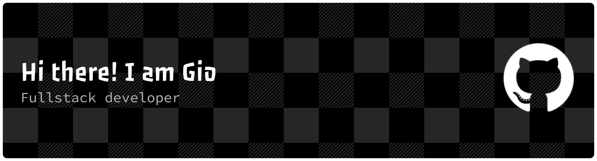

# Konnichiwa minasan

#### 🌐 Socials:
 

## What I Love Building

<table>
<tr>
<td align="center" width="33%">

### AI-Driven Systems

**Intelligent Agents** • **NPC Behaviors** • **Procedural Generation** • **Autonomous Decision Making**

Crafting intelligent systems where AI entities make autonomous decisions, learn from patterns, adapt to environments, and create emergent, dynamic gameplay experiences that feel truly alive.

</td>
<td align="center" width="33%">

### Simulation Engines

**Physics Modeling** • **Astronomy Visualization** • **Real-time Rendering** • **Interactive Experiences**

Developing realistic physics-based simulations and astronomical visualizations that bring complex scientific concepts to life through interactive, educational, and visually stunning experiences.

</td>
<td align="center" width="33%">

### Automation Tools

**Smart Dashboards** • **Data Pipelines** • **AI Assistants** • **Workflow Automation**

Engineering powerful automation solutions that eliminate repetitive tasks, streamline complex workflows, and empower teams to focus on creative problem-solving rather than manual processes.

</td>
</tr>
</table>

---

##  Let's Connect & Collaborate

 **Open to discussing AI products, research collaborations, or building something innovative together!** 

 

 
 

<!-- Proudly created with GPRM ( https://gprm.itsvg.in ) -->

